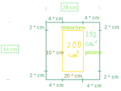

```{r setup, include=FALSE}
knitr::opts_chunk$set(echo = TRUE)
```

## Raamat

### Ülesande püstitus

Raamatu leheküljele laotatakse 200 cm2 teksti. Lehe all ja ülaosas peaks olema 2 cm laiused servad. Vasakul ja paremal äärel aga 4 cm laiused servad. Missuguste mõõtmetega peaks olema lehekülg, et paberit kuluks võimalikult vähe?

### Lahendus



Ilmselt on lehekülg ristkülikukujuline, kuigi seda pole täpsustatud. Seega eeldan, et on ristkülikukujuline. On sisemine ristkülik ja välimine ristkülik. Sisemine ristkülik on tekstiala ja välimine ristkülik on terve lehekülg. Tähistan sisemise ristküliku mõõtmed kui rõhtneServ ja püstine. Vaja on minimeerida lehekülje pindala. Selleks on vaja lehekülje pindala funktsiooni:

$$200 * cm ^ 2 + (2 * cm) * (2 * 4 + rõhtneServ) * cm * 2 + (4 * cm) * püstine * 2 * cm.$$

Teen selle lihtsamaks:

$$200 * cm ^ 2 + (4 * cm) * (8 + rõhtneServ) * cm + (8 * cm ^ 2) * püstine$$

$$=== 200 * cm ^ 2 + 32 * cm ^ 2 + (4 * cm ^ 2) * rõhtneServ + (8 * cm ^ 2) * püstine$$

$$=== 232 * cm ^ 2 + (4 * rõhtneServ + 8 * püstine) * cm ^ 2.$$

Sisendeid on kaks, seega on vaja ühest lahti saada. Avaldan rõhtsa serva pikkuse püstise serva pikkuse kaudu. Tekstiala pindala on

$$200 * cm ^ 2 === rõhtneServ * cm * püstine * cm.$$

Sellest võrdusest

$$rõhtneServ = \frac{200}{püstine}.$$

Nüüd asendan funktsiooni rõhtsa serva sisendi viimase avaldise parema poolega:

$$232 * cm ^ 2 + (4 * \frac{200}{püstine} + 8 * püstine) * cm ^ 2$$

$$=== 232 * cm ^ 2 + (\frac{800}{püstine} + 8 * püstine) * cm ^ 2$$

$$=== 232 * cm ^ 2 + \frac{(800 + 8 * püstine ^ 2)}{püstine} * cm ^ 2$$

$$=== \frac{(232 * cm ^ 2 * püstine + 800 * cm ^ 2 + 8 * püstine ^ 2 * cm ^ 2)}{püstine}.$$

Ekstreemum võib esineda kohas, kus funktsiooni tuletise väärtus on null. Seega arvutan selle funktsiooni tuletise püstise serva järgi:

$$\frac{(püstine * (232 * cm ^ 2 + 16 * püstine * cm ^ 2) - (232 * cm ^ 2 * püstine + 800 * cm ^ 2 + 8 * püstine ^ 2 * cm ^ 2) * 1)}{püstine ^ 2}$$

$$=== \frac{(püstine * 232 * cm ^ 2 + 16 * püstine ^ 2 * cm ^ 2 - 232 * cm ^ 2 * püstine - 800 * cm ^ 2 - 8 * püstine ^ 2 * cm ^ 2)}{püstine ^ 2}$$

$$=== \frac{(8 * püstine ^ 2 * cm ^ 2 - 800 * cm ^ 2)}{püstine ^ 2}.$$
Kontrollin:

```{r}
functionToUse = expression((232 * y + 800 + 8 * y ^ 2) / y)
calculateArea <- function(y) {
  eval(functionToUse)
}

derivative = D(functionToUse, "y")
derivative
derivativeAsText = eval(deparse(derivative))
```


See on nüüd vaja nulliga võrdsustada. Pärast võrrandi lahendamist on tulemus, et

$$püstine = 10 * cm.$$

Kontrollin:

```{r}
library(Ryacas)

extrema = yac_str(y_rmvars(paste("Solve(", derivativeAsText, ", y)", sep = "")))
extrema
```

Tuleb välja selgitada, milline ekstreemum see on. Selleks arvutan esmalt algfunktsiooni väärtuse kohal 10 * cm ja saan, et see on 398\*cm^2^. Proovin 10'st cm'st veidi väiksemat arvu algfunktsiooni, nt ühe ja saan suurema väljundi kui 398 * cm^2^. Proovin 10'st cm'st veidi suuremat arvu, nt 100 * cm ja saan samuti 398 * cm^2^'st suurema väljundi. Seega on kohal 10 * cm miinimum.

Kontrollin:

```{r}
xOfExtrema = as.numeric(as_r(extrema)[1])
calculateArea(xOfExtrema)
calculateArea(xOfExtrema * .9)
calculateArea(xOfExtrema * 1.1)
```

10 * cm on tekstiala püstise serva pikkus. Seega lehekülje püstise serva pikkus on 14 * cm ja lehekülje rõhtsa serva pikkus on 28\*cm.

Kontrollin:

```{r}
vertical = xOfExtrema + 2 * 2
vertical
horizontal = 200 / xOfExtrema + 2 * 4
horizontal
```